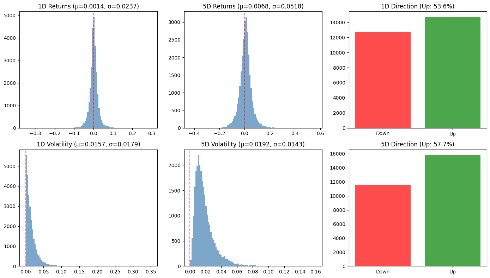
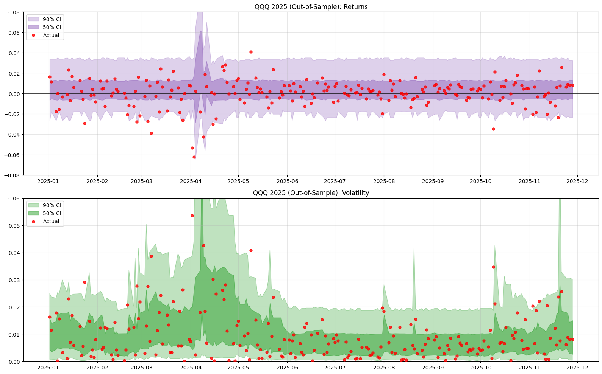
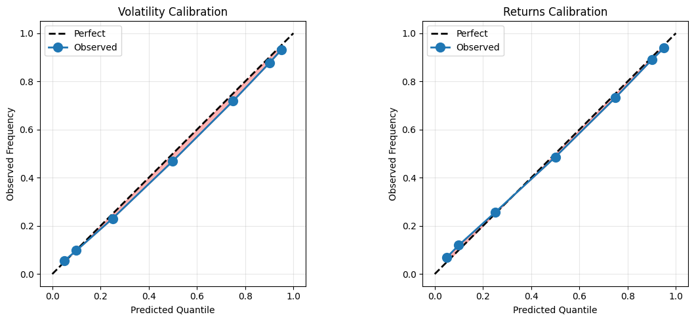

# Predicting Return and Volatility Distributions

Team: Jake and Jolie

A machine learning project demonstrating that while short-term stock returns are largely unpredictable, volatility can be forecasted with meaningful accuracy using quantile regression forests.

## Problem Statement

**Context**: Financial markets exhibit varying degrees of predictability across different targets. While the Efficient Market Hypothesis suggests returns are difficult to predict, volatility displays well-documented clustering behavior that may be exploitable.

**Objective**: Predict the *distribution* of short-term (1-day, 5-day) returns and volatility for tech stocks - not just point estimates, but calibrated prediction intervals that quantify uncertainty.

**Scope**:
- Universe: QQQ ETF and its top 10 holdings (NVDA, MSFT, AAPL, AVGO, AMZN, TSLA, META, GOOGL, GOOG, NFLX)
- Time period: 2016-2024 for training/CV, 2025 for out-of-sample validation
- Prediction horizons: 1-day and 5-day forward returns and volatility

**Why QQQ + Top Holdings?**: Tech stocks exhibit high volatility with strong clustering behavior, making them ideal for testing volatility prediction. Using QQQ plus its top holdings provides sufficient training data while keeping assets correlated enough for patterns to transfer across tickers.

## Dataset Description

**Source**: Yahoo Finance via `yfinance` API

**Fields**:
- **Core OHLCV**: Open, High, Low, Close, Volume (daily)
- **Technical indicators** (109 features total):
  - Price-based: Lagged returns (16), trend (10), momentum (9), volatility (12), volume (14), patterns (12)
  - External data: VIX/CBOE indices (16), fixed income/credit spreads (8), cross-asset (8), sector dispersion (4)
- **Targets**: 1D/5D forward returns, direction (binary), and realized volatility

**Size**:
- 27,412 total samples (11 tickers x ~2,500 trading days)

**License**: Yahoo Finance data is subject to their Terms of Service. This project is for educational/research purposes only.

## Approach Summary

### EDA Highlights



- Returns exhibit high kurtosis (12.6) indicating fat tails - extreme events more frequent than normal distribution
- Volatility is right-skewed (3.7) with occasional large spikes
- Strong autocorrelation in volatility (clustering) vs. near-zero for returns
- biased up direction

### Models
| Model | Type | Use Case |
|-------|------|----------|
| Ridge Regression | Linear baseline | Returns/volatility point prediction |
| Logistic Regression | Linear baseline | Direction classification |
| Random Forest | Non-linear | Point prediction, feature importance |
| **Quantile Random Forest** | **Distribution** | **Main model - prediction intervals** |
| GARCH(1,1) | Time series baseline | Volatility benchmark |

### Rationale
- **Walk-forward CV**: Expanding window (train on 2016, test 2017 -> train on 2016-2017, test 2018 -> ...) prevents look-ahead bias
- **Quantile RF over point predictions**: Captures uncertainty; produces calibrated intervals showing model confidence
- **QRF over GARCH**: Leverages cross-asset features (VIX, volume, sector dispersion) that univariate GARCH cannot use

## Key Results

### Distribution Prediction Performance



| Target | CV Correlation | OOS Correlation | 90% Coverage | 50% Coverage |
|--------|----------------|-----------------|--------------|--------------|
| Returns 1D | 0.042 | 0.171 | 86.9% / 82.9% | 47.7% / 42.8% |
| Returns 5D | 0.062 | - | 84.4% | 44.1% |
| **Volatility 1D** | **0.403** | **0.446** | **87.6% / 89.2%** | **48.8% / 50.3%** |
| Volatility 5D | 0.556 | - | 88.1% | 48.3% |

### Model Comparison (Volatility)
- **QRF vs GARCH**: 0.221 vs 0.147 correlation on QQQ (+50% improvement)
- **RF vs Ridge**: 0.418 vs 0.349 correlation (non-linear patterns matter)

### Calibration



- Mean absolute calibration error: 1.8% (volatility), 1.4% (returns)
- Near-perfect diagonal on calibration plots - model "knows what it doesn't know"

### Feature Importance (Top 5 for Volatility)
1. `vol_atr_pct` (ATR as % of price): 0.177
2. `vlm_ratio_20` (volume vs 20-day avg): 0.038
3. `vlm_ratio_10`: 0.013
4. `vlm_ratio_5`: 0.008
5. `vol_parkinson` (Parkinson volatility): 0.006


## Reproducibility

### Requirements
- Python >= 3.11 (tested with 3.11, 3.12)

### Installation

```bash
# Clone repository
git clone https://github.com/jakeryderv/ml-market.git

# uv create virtual environment and install dependencies
uv sync

# Or with pip
pip install -r requirements.txt
```

## Ethics, Risks, and Limitations

### Data Leakage Risks
- **Mitigated**: Walk-forward CV ensures no future information leaks into training
- **Mitigated**: External data (VIX, sectors) aligned by date, not forward-filled across time boundaries
- **Caution**: Some features use same-day data (e.g., volume) which is available in practice but introduces subtle timing assumptions

### Bias and Limitations
- **Survivorship bias**: Only includes current QQQ top holdings; excludes delisted/removed stocks
- **Selection bias**: Tech-heavy universe may not generalize to other sectors
- **Regime dependence**: Trained primarily on 2016-2024 (low rates, tech bull market); may underperform in different regimes
- **OOS period short**: Only ~230 trading days of true OOS (2025 YTD)

### Ethical Considerations
- **Not financial advice**: This is an educational project demonstrating ML techniques
- **Market impact**: Strategies based on public data face crowding risk
- **Model opacity**: Random forests are less interpretable than linear models; feature importance helps but doesn't fully explain predictions
